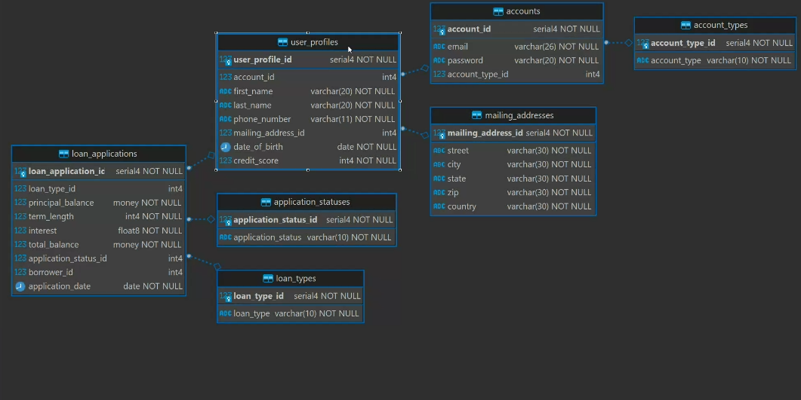

## **1. `account_types`**
- **Primary Key (PK):** `account_type_id`
- **Columns:**
  - `account_type_id` (e.g., `SERIAL NOT NULL`)
  - `type_name` (e.g., `VARCHAR(50) NOT NULL`)

---

## **2. `accounts`**
- **Primary Key (PK):** `account_id`
- **Columns:**
  - `account_id` (e.g., `SERIAL NOT NULL`)
  - `email` (e.g., `VARCHAR(100) NOT NULL`)
  - `password` (e.g., `VARCHAR(100) NOT NULL`)
  - `account_type_id` (FK to **`account_types(account_type_id)`**)
    - Ensures each account references a valid type (e.g., *Manager*, *User*, etc.)

---

## **3. `user_profiles`**
- **Primary Key (PK):** `user_profile_id`
- **Columns:**
  - `user_profile_id` (e.g., `SERIAL NOT NULL`)
  - `account_id` (FK to **`accounts(account_id)`**)
    - Links each user profile to its corresponding account credentials.
  - `first_name` (e.g., `VARCHAR(50)`)
  - `last_name` (e.g., `VARCHAR(50)`)
  - `phone_number` (e.g., `VARCHAR(20)`)
  - `dob` (e.g., `DATE`)
  - `credit_score` (e.g., `INT`)

---

## **4. `mailing_addresses`**
- **Primary Key (PK):** `mailing_address_id`
- **Columns:**
  - `mailing_address_id` (e.g., `SERIAL NOT NULL`)
  - `user_profile_id` (FK to **`user_profiles(user_profile_id)`**)
  - `street_address` (e.g., `VARCHAR(100)`)
  - `city` (e.g., `VARCHAR(50)`)
  - `state` (e.g., `VARCHAR(50)`)
  - `zip` (e.g., `VARCHAR(20)`)
  - `country` (e.g., `VARCHAR(50)`)

---

## **5. `application_statuses`**
- **Primary Key (PK):** `application_status_id`
- **Columns:**
  - `application_status_id` (e.g., `SERIAL NOT NULL`)
  - `status` (e.g., `VARCHAR(50) NOT NULL`)
    - Example values might be *pending*, *approved*, *rejected*.

---

## **6. `loan_types`**
- **Primary Key (PK):** `loan_type_id`
- **Columns:**
  - `loan_type_id` (e.g., `SERIAL NOT NULL`)
  - `name` (e.g., `VARCHAR(50) NOT NULL`)
    - Example values might be *personal*, *auto*, *mortgage*, etc.

---

## **7. `loan_applications`**
- **Primary Key (PK):** `loan_application_id`
- **Columns:**
  - `loan_application_id` (e.g., `SERIAL NOT NULL`)
  - `user_profile_id` (FK to **`user_profiles(user_profile_id)`**)
    - Identifies which user submitted the loan application.
  - `loan_type_id` (FK to **`loan_types(loan_type_id)`**)
  - `application_status_id` (FK to **`application_statuses(application_status_id)`**)
  - `amount_requested` (e.g., `DECIMAL(12,2)` or `NUMERIC(12,2)`)
  - `application_date` (e.g., `DATE`)

---

### **Why This Schema Supports 3rd Normal Form**

1. **Each table represents a single entity** (e.g., `accounts`, `user_profiles`, `loan_applications`), avoiding partial dependencies.
2. **No repeating groups**: columns are atomic (e.g., `first_name`, `last_name` instead of a combined name field).
3. **No transitive dependencies**: all non-key columns depend directly on the primary key of their table (e.g., `account_id` in `user_profiles` is a direct reference to `accounts.account_id`).

You can further refine data types, constraints (e.g., `NOT NULL`, `UNIQUE`), and indexing strategies as needed. This extracted schema forms a strong foundation for a **3rd Normal Form** database design.