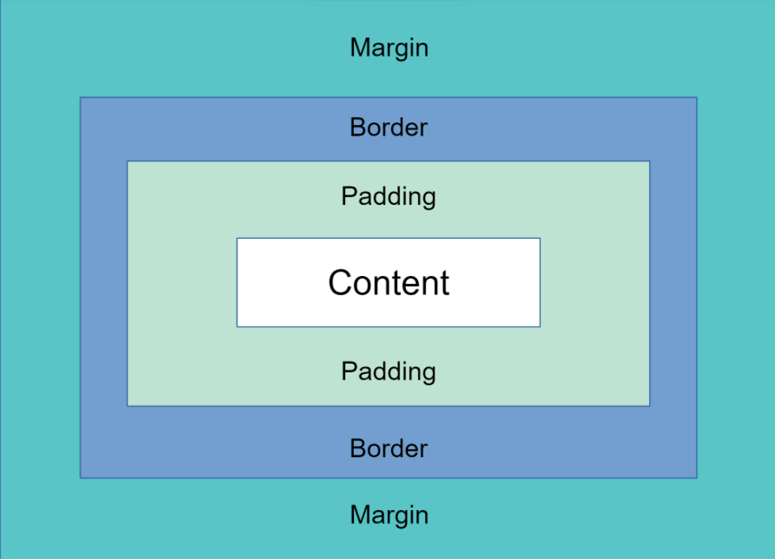
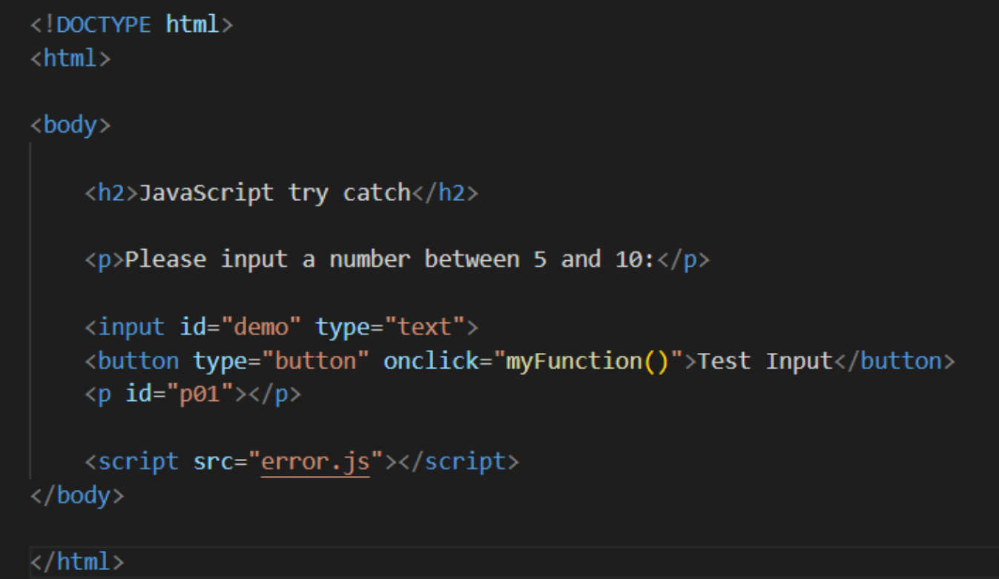
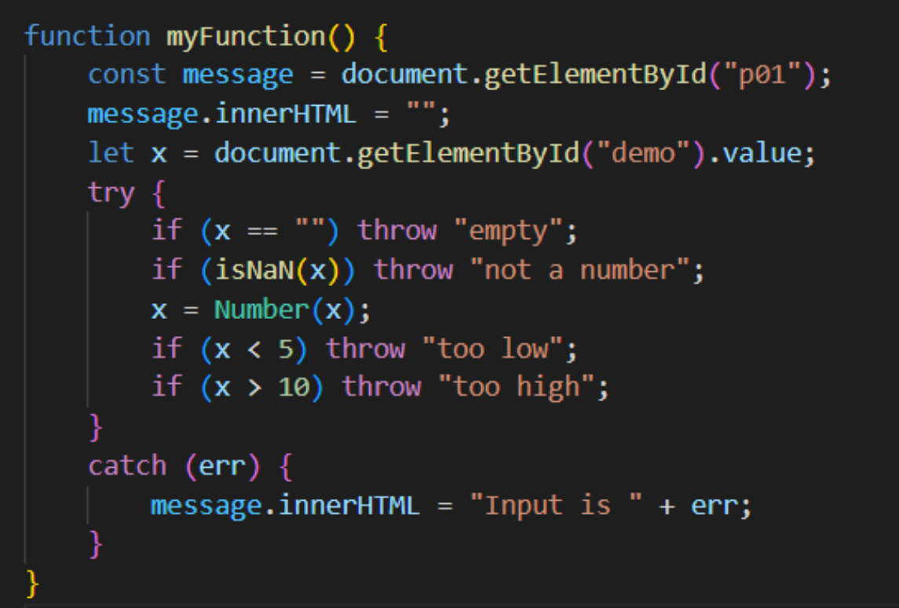
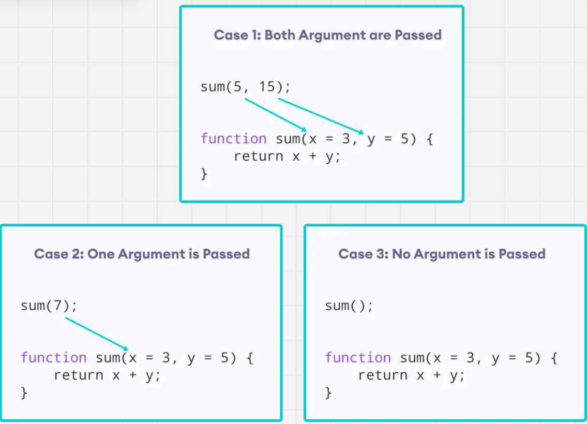

# HTML
**Hypertext Markup Language**  
Another markup language that means it is just telling the computer what to do and not compiling it into machine code  
Very similar to XML (pom.xml) but HTML is used to define the structure of our webpages  
Our browsers are essentially experts at reading this file and interpreting it to display something on the browser  
Current version of HTML 5

## HTML Technical Terms

### HTML Elements
- They are basic graphical units that will display or structure your webpage

### HTML Tag
- They are the syntax required to reference the HTML element for your browser to display

### Inline vs Block Elements
- **Block elements** will add new elements to a new line (think of `println()`)
- **Inline elements** will add new elements in the same line (think of `print()`)

### Semantic Elements
- A new addition in HTML5 that confused a bunch of people or is barely even used
- In a more technical way, they are just used to clearly define the purpose of a certain section of your HTML file (compared to a generic `
`)
- **Example:** `<article>` or `<table>` element

### HTML Attributes
- They are used to provide extra information that the tag can use
- Usually changes its behavior in some shape or form
- **Example:** An image element uses the `src` attribute to find the location of the image you want to display

# Introduction to CSS

**Cascading Style Sheets**  
A way to stop making your website look like it came from the 90s  
Cascading is in the name because that is the algorithm it uses to apply styling to an element

## Different Ways to Apply CSS

### Internal CSS
- Applies CSS by using the `<style>` tag (usually in the `<head>` tag)
- Used to apply multiple CSS rules within the same HTML document

### Inline CSS
- Applies CSS by using the `style` attribute on an HTML element
- Used to apply CSS rules to one specific HTML element

### External CSS
- Applies CSS by creating an external `.css` file and applying CSS rules across multiple HTML documents
- You can reference external CSS using the `<link>` element
- Used to apply CSS rules to multiple HTML documents

## CSS Selectors

### Id Selector
- When you want to select one element using the `id` attribute

### Class Selector
- When you want to select multiple elements of differing tags by using the `class` attribute

### Element Selector
- When you want to universally select one element

# Ways to Position Your Elements on Your Website

## Box Model

### Margin
- Outermost layer
- Useful for adding space between your elements

### Border
- Second outermost layer
- Useful to add borders (boxing your elements)

### Padding
- Space between the border and content
- Used to position the content in a different location within the border

### Content
- The main meat of whatever element you are using
  - If it was an image element, then it would be the image itself
  - If it was a `
`, then it would be the nested elements/text within the `
`

## CSS Grid
- The more proper way to layout your website's structure
- It puts your HTML elements in a grid-like system
- **Note:** `display: grid;` is essential—don't forget it!
- `grid-template-columns` is pretty much all you need to set up the grid
- There are many CSS properties that will help you customize your grid further

[Complete Guide to Grid | CSS-Tricks](https://css-tricks.com/snippets/css/complete-guide-grid/)

# Intro To JavaScript

**JavaScript** is a high-level programming language generally used for front-end development. It has built-in support in all web browsers.  
It is possible to do server-side JS with NodeJS and plenty of applications do.  
JS is **multi-paradigm**: it supports procedural programming, functional programming, and OOP.  
JS is **weakly typed** and **loosely typed**—any variable can hold any type of data.  
JS is **interpreted**, lightweight, and object-oriented with first-class functions.  
The official language specifications for JS are **ECMAScript**. This is important to know when discussing versions (e.g., ES6 or ES2019).  
JS was designed in a very short amount of time (10 days), which means there are some quirks in the language that remain due to backwards compatibility concerns. By ES6, most things have been standardized so that you won’t encounter these issues as often.

## HTML Support
- JS uses the `<script>` tag in HTML. This allows for the writing of raw JS inside HTML, similar to how we can do inline CSS.

- **Example Video:**  
  [Watch this video on some of JS quirks](https://www.destroyvallsoftware.com/talks/wat)

- You don't have to declare variable types—you can change variable types as needed.

# JS Syntax

- **Comments:**  
  Comments in JavaScript are the same as in Java. Use `//` for single-line comments or `/* ... */` for multi-line comments.

- **JavaScript Literals (Primitives):**  
  These are your fixed values, such as numbers, strings, booleans, etc.

- **Keywords:**  
  JS has keywords like `break`, `catch`, `do`, `else`, `if`, etc.

- **Control Flow Statements:**  
  Generally the same as in Java, with some differences (like enhanced for-loops).

- **Semicolons:**  
  Semicolons end lines, but they are not strictly required—JavaScript will infer them.

# JS Variables

- Variables in JS are stored similarly to variables in Java. The assignment operator is `=`, and there are shorthand operators like `+=`, `-=`, etc.

- **Variable Naming Rules:**  
  - Must start with a letter, an underscore (`_`), or `$`
  - Can contain numbers, but cannot start with a number

- **Variable Declaration Methods (introduced in ES6):**  
  - **var:** The older, default declaration  
  - **let:** Preferred declaration for mutable variables  
  - **const:** For constants; similar to `let` but cannot be mutated

## Scopes in JS
- **Global Scope:**  
  The variable is visible throughout the whole script.
- **Functional Scope:**  
  A variable declared inside a function exists only while that function is executing.
- **Block Scope:**  
  A variable declared within a block (e.g., in an `if` statement or loop) is only visible within that block. This scope applies to `let` and `const` (but not to `var`).

# JS Datatypes

## Primitive Datatypes
- **number:** All numeric values (integers and decimals)
- **string:** A collection of characters
- **boolean:** `true` or `false`
- **null:** Represents a lack of value; the variable doesn’t hold any information at the moment
- **undefined:** A variable that has been declared but not assigned a value
- **Symbol:** Added in ES6; not commonly used

## Reference Types
- **Object:**  
  JS objects are key/value pairs defined within curly braces (`{}`) with keys and values separated by a colon. The value can be any type (including other objects or functions). Objects do not have to be defined from a class.
- **BigInt:**  
  Used to hold large integer values beyond the normal number range.
- **Infinity and -Infinity:**  
  These are numeric values typically seen when dividing by 0.
- **Arrays:**  
  Arrays are objects with numeric indices as keys. They can hold mixed types and are mutable (their length can change).
- **Date:**  
  A built-in object for handling dates.
- **Functions:**  
  Functions are objects in JS. They can be passed as arguments to other functions, similar to lambdas in Java.
- **typeof Operator:**  
  Used to check the type of a value.

# Type Coercion

- **Definition:**  
  Type coercion is the process of converting values between datatypes, similar to casting primitives in Java. JS does this implicitly at times.
  
- **Explicit Coercion Examples:**  
  - `Number("3")` converts the string `"3"` to the number `3`.  
  - `String(123)` converts the number `123` to the string `"123"`.
  
- **Common Scenarios:**  
  Implicit coercion often occurs when checking equality with `==` or using the `+` operator for addition/concatenation. Use `===` for strict equality without coercion.

# JS Operators

- **Comparison Operators:**  
  Similar to Java (e.g., `>`, `<`, `>=`, `!=`, `<=`).  
  - `==` performs type coercion when checking equality  
  - `===` checks equality without type coercion (e.g., `6 === "6"` is false)
  
- **Other Operators:**  
  Assignment (`=`), logical (`&&`, `||`, `!`), arithmetic (`+`, `-`, `*`, `/`, `++`, `--`, `%`), and ternary (`condition ? trueValue : falseValue`).

# Truthy/Falsey

- **Definition:**  
  Any expression or value in JS can be evaluated as a boolean. The terms "truthy" and "falsey" refer to how values evaluate in boolean contexts.
- **Falsey Values Include:**  
  `false`, empty string (`""`), `undefined`, `null`, `NaN`, `0`

# Functions

- **Definition:**  
  Functions are reusable sets of instructions that can be called within the scope they were declared.
- **Hoisting:**  
  Functions are hoisted (like `var` variables) so they are available throughout their scope.
- **Declaration:**  
  Declared with the `function` keyword. They can be named or anonymous (assigned to a variable).
- **Arrow Functions:**  
  Introduced in ES6, arrow functions (e.g., `() => { ... }`) provide a shorter syntax for functions, especially for one-time use or callback functions.
- **Callback Functions:**  
  Functions passed into another function as a parameter, then called by the outer function.
- **Closures:**  
  Closures allow an inner function to access variables from an outer function even after the outer function has finished executing.

# Arrays

- **Definition:**  
  An array allows you to store multiple values in a single variable.
- **Creation:**  
  - **Array Literal:** `let myArr = ["one", "two", "three"]`
  - **Using `new` keyword:** `let primes = new Array(2, 3, 5, 7)`
- **Characteristics:**  
  Arrays are objects, can hold mixed types, and are mutable.
- **Common Methods:**  
  `forEach`, `map`, `filter

  # Introduction to HTML DOM

**Document Object Model (DOM)**  
- Allows JS to specifically pick certain elements in the HTML and change/manipulate them based on whatever function you want.
- Essentially, converts HTML into objects that JS understands very well.
- Using JS with the DOM makes your website dynamically change at runtime.

## Bubbling Events
- This is when events in HTML bubble up (from child to parent element) and execute each element's functionality.
- By default, events use bubbling behavior.

## Capturing Events
- This is when events in HTML go from parent to child element and execute each element's functionality.
- You must explicitly tell JS to use capturing behavior by using `addEventListener` with the capturing option set to `true`.

## Strict Mode
- JavaScript is a loosely typed scripting language. JS allows strictness of code by using `"use strict";`
- `"use strict";` goes at the top of the JS file/code (or at the top of a function).
- In strict mode:
  - Undefined variables are not allowed.
  - Reserved keywords cannot be used.
  - Duplicate parameters are not allowed.
  - Assigning values to read-only properties is disallowed.
  - Deleting functions and properties is disallowed.
- **Conclusion:** Always use strict mode to prevent odd behavior.

## Timing Events
- In JS, you have ways to time events, which is useful for automating tasks or running a function after a certain delay.
- Two key timing methods (both belonging to the `window` object):
  - **setTimeout():**
    - Signature: `window.setTimeout(callbackFunction, milliseconds)`
    - Executes the callback function after waiting a specified number of milliseconds.
  - **setInterval():**
    - Similar to `setTimeout()`, but repeatedly executes the callback function at the specified interval.

# JS Classes

- **Definition:** Templates for creating objects.
- Introduced in ECMAScript 6.
- Implements most of the OOP pillars, but not all.

## OOP in JavaScript

### Inheritance
- Achieved by using the `extends` keyword.
- Similar to how Java works: a subclass inherits all members (methods and properties) from its superclass.

### Encapsulation
- Traditional access modifiers do not exist in JS.
- However, using a `#` syntax before a field name gives it "private" behavior.
- You must then use getter/setter methods to control access to private fields.

### Polymorphism
- Polymorphism doesn't work well in JS.
- You cannot have method or constructor overloading (i.e., same method names with different parameters).
- You can use default parameters to emulate some aspects of polymorphism.

### Abstraction
- Abstraction doesn't work very well in JS.
- Interfaces or abstract classes do not exist natively.
- To enforce interface-like functionality, you must explicitly throw an error if an object is missing required properties.

# Errors and Advanced JavaScript Concepts

## Errors

|  |  |
| :------------------------------------------: | :------------------------------------------: |

### Throw, and Try...Catch...Finally
- **try statement:**  
  Defines a code block to run (to try).

- **catch statement:**  
  Defines a code block to handle any error.

- **finally statement:**  
  Defines a code block to run regardless of the result.

- **throw statement:**  
  Defines a custom error. The exception can be a JavaScript String, a Number, a Boolean, or an Object.

- When an error occurs, JavaScript will normally stop and generate an error message.

### Default Parameters in JS

## Fetch API
- **Definition:**  
  A way to interact with a RESTful API. It fetches resources across the network using the HTTP protocol and returns a response object in the form of a promise.

- **What is a Promise?**  
  - It represents a success or a failure of some asynchronous operation and gives the resulting value.
  - It is our way of handling asynchronous operations in JS.
  - The `then()` method will execute if the promise was successful.
  - The `catch()` method will execute if the promise encountered an error.
  - The `finally()` method will execute regardless of the outcome of the promise.

## Async & Await
- **Overview:**  
  An extension of promises. Instead of using pre-made methods to handle promises, we can use an `async` function and then use `await`.

- **await:**  
  Will store the result of the promise regardless of whether it was successful or not.

- **async:**  
  Is needed to use `await`, but an async function doesn't necessarily need to use `await` to work.

## More JavaScript

### Spread Operator
- **Functionality:**  
  It will spread an array or string into its individual elements.
  
- **Examples:**  
  - `[1, 2, 3]` → `1 2 3`  
  - `"Hello"` → `"H" "e" "l" "l" "o"`

- **Usage:**  
  - Useful for combining two or more arrays together.
  - Useful to pass in as parameters in a function that requires multiple parameters, with each element mapped into individual parameters.

### Rest Parameter
- **Definition:**  
  Used to create a function that can accept an indefinite number of parameters.

- **Behavior:**  
  It acts as an array within the function and can be used with array methods such as `.forEach()`.
