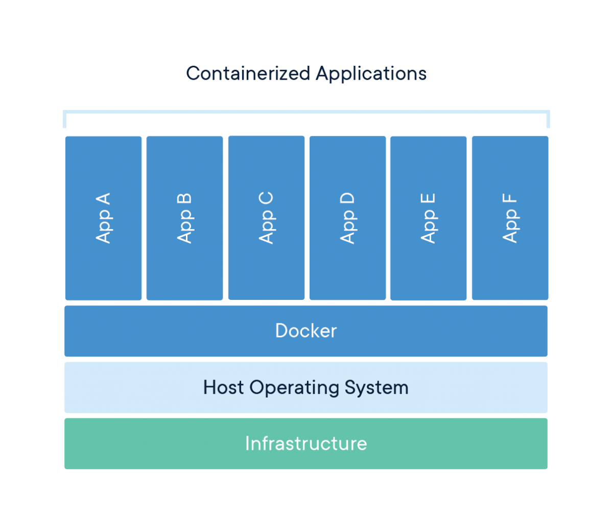
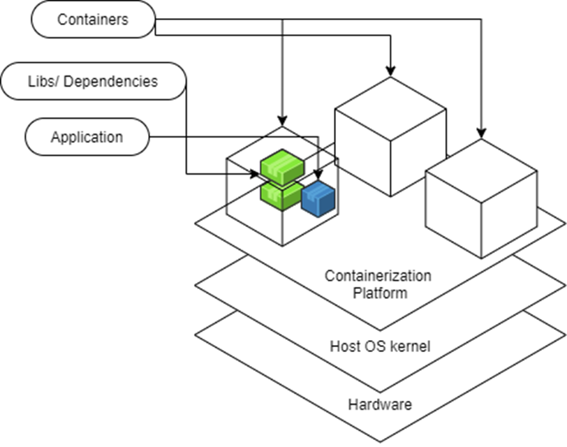
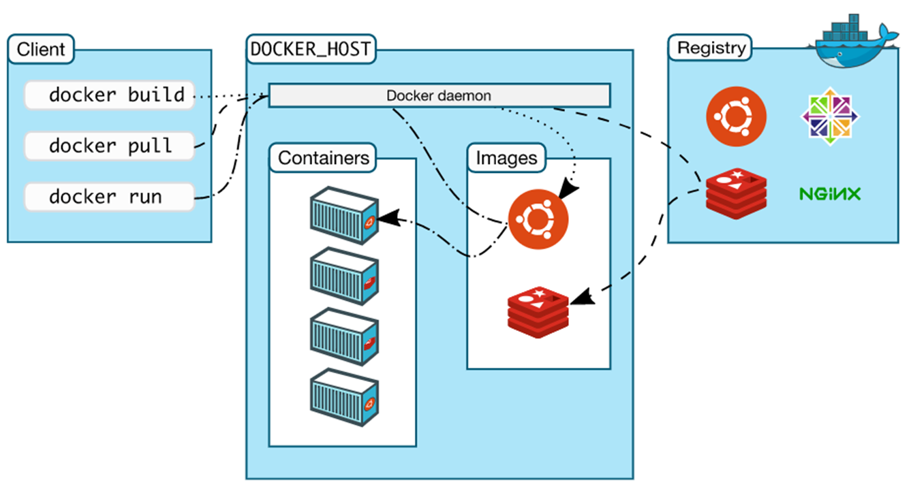
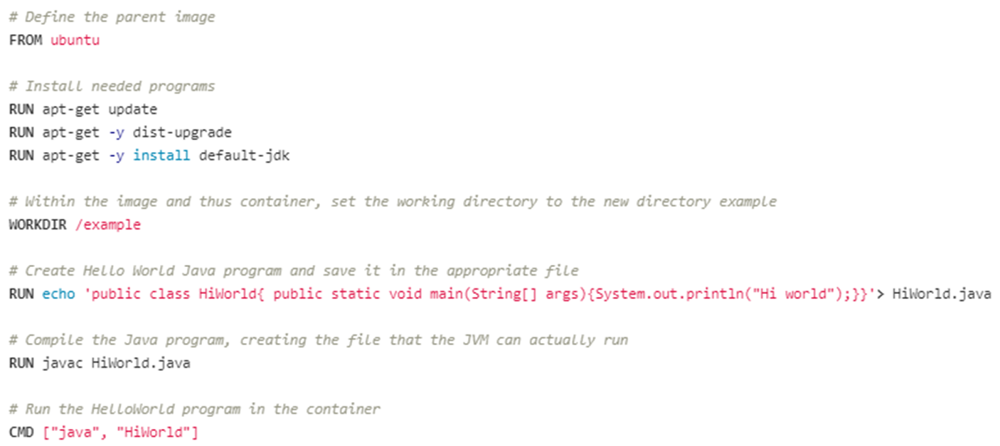

Sure! Below is a structured Markdown document based on the content you provided. You can manually add images where placeholders are indicated.

---

# Docker

## Table of Contents

1. [What is Docker](#what-is-docker)
2. [Containerization](#containerization)
3. [Containers](#containers)
   - [Benefits](#benefits)
   - [Pros and Cons](#pros-and-cons)
4. [Containers vs. Virtual Machines](#containers-vs-virtual-machines)
   - [Virtual Machines](#virtual-machines)
   - [Pros and Cons](#pros-and-cons-1)
5. [Docker Architecture](#docker-architecture)
   - [Components](#components)
6. [Docker Objects](#docker-objects)
   - [Images](#images)
   - [Containers](#containers-1)
7. [Typical Flow](#typical-flow)
8. [Docker Images](#docker-images)
   - [Existing Docker Images](#existing-docker-images)
   - [Building Our Own Images](#building-our-own-images)
   - [Image Management](#image-management)
9. [Docker Containers](#docker-containers)
   - [Benefits](#benefits-1)
   - [States of a Container](#states-of-a-container)
10. [Docker Volumes](#docker-volumes)
11. [Docker Best Practices](#docker-best-practices)
12. [Dockerfile](#dockerfile)
    - [Keywords](#keywords)
    - [Examples](#examples)
13. [Building an Image](#building-an-image)
    - [Example](#example)
    - [Create Image with Commit](#create-image-with-commit)
    - [Image Management](#image-management-1)
14. [Docker Compose](#docker-compose)
    - [Compose File Components](#compose-file-components)
    - [Compose File Options](#compose-file-options)
    - [Examples](#examples-1)

---

## What is Docker

Docker is an open-source project that automates the deployment of software applications inside containers by providing an additional layer of abstraction and automation of OS-level virtualization on Linux.

Docker is a tool that allows developers, sys-admins, etc., to easily deploy their applications in a sandbox (called containers) to run on the host operating system, i.e., Linux.

---

## Containerization



---

## Containers

A container is a mechanism for packaging an application (or a limited number of processes) with its dependencies so that it runs in its own isolated sandbox.

Containerization helps ensure that the application or set of processes can run reliably regardless of the host environment. The container shouldn't be able to modify or interact with anything it doesn't need, and changes in the container should not affect the host or other containers (and vice versa).




### Benefits

- **Secure**
  - Isolation and virtualization keep your containerized apps more secure.
- **Standardized and Portable**
  - Think "write once, run anywhere."
- **Lightweight**
  - Shares the host operating system's kernel.
- **Flexible and Loosely Coupled**
- **Scalable**
  - Easy to spin up and can be scaled up quickly due to their lightweight nature.

### Pros and Cons

**Pros:**

- Considered "lightweight" because they don't require spinning up a whole guest OS.
- Enable layers of isolation or partial isolation, depending on implementation.
- Provide a virtualized view of certain resources.
- Package an application in an isolated environment.
- Ensure an application runs reliably regardless of the host.

**Cons:**

- If you need very strict and complete isolation, having layers can be a downside.

---

## Containers vs. Virtual Machines

Both virtual machines (VMs) and containers provide the ability to isolate processes from one another and offer virtualization so that processes can run in their own sandbox environments on the same host machine. However, they achieve this in different ways.

### Virtual Machines

Virtual Machines simulate a physical server, allowing multiple "servers" to run on a single machine by virtualizing the entire supporting OS. This means you can run a Linux OS and an application on top of a Windows-based host, for example.

**Pros:**

- Near total isolation.
- Provides virtualization of the entire OS.
- Ensures an application runs reliably regardless of the host.

**Cons:**

- Considered "bulky" and resource-intensive.

### Containers

Containers bundle together applications with their supporting libraries and dependencies, allowing them to run isolated from one another. However, containers share the underlying OS kernel, making them much lighter than virtual machines.

**Pros:**

- Lightweight.
- Enable layers of isolation.
- Provide a virtualized view of certain resources.
- Package applications in isolated environments.
- Ensure applications run reliably regardless of the host.

**Cons:**

- Less isolation compared to VMs, which can be a drawback if strict isolation is required.

---

## Docker Architecture

Docker adheres to a Client-Server Architecture. The client allows you to run commands and interact with Docker objects managed by the Docker daemon, which acts as the server.

### Components

- **Docker Daemon:** Manages Docker objects such as containers and images.
- **REST API:** Underlying commands used by the CLI and other applications to interact with the Docker daemon.
- **Docker CLI Client:** Command-line interface for interacting with Docker.
- **Docker Registries:** Centralized places to store and share Docker images.
- **Docker Objects:** Building blocks managed by the Docker daemon, primarily images and containers.



### Docker Architecture Details

- **Client:** Includes commands that manage Docker containers and images.
- **Docker Host:** The computer where the Docker daemon runs.
- **Docker Daemon:** Responsible for managing Docker objects.
- **Registry:** Optional component for sharing Docker images.
- **REST API:** Connects the client and Docker daemon.

---

## Docker Objects

Docker objects are the building blocks managed by the Docker daemon.

### Images

Images are the templates that outline all dependencies for a particular container and its primary process.

### Containers

A container is the runnable instance of a set of processes and their dependencies.

---

## Typical Flow

1. **Acquire an Image:**
   - Use CLI commands such as `docker build` or `docker pull` to acquire an image.
2. **Docker Daemon Actions:**
   - The Docker daemon pulls the image from a registry or creates it based on the command.
3. **Run a Container:**
   - Use `docker run` to spin up a container from the image.
   - Example:
     ```bash
     docker run hello-world
     ```
4. **Manage the Container:**
   - Use additional CLI commands to manage the running container.
   - If the primary process finishes, the container will exit on its own.

---

## Docker Images

### Existing Docker Images

- **Pull Images:**
  - From existing registries (e.g., Docker Hub).
  - Example:
    ```bash
    docker pull <image-name>
    docker run <image-name>
    ```
  - The `docker run` command will pull the image if it doesn't exist locally.

### Building Our Own Images

- **Dockerfile:** Defines how to build the image.
- **From Existing Container:**
  - Use `docker commit` to create a new image from a running container.
- **Push to Registry:**
  - Push your images to a registry like Docker Hub.

### Image Management

- **List Images:**
  ```bash
  docker images
  docker images -a  # Lists all images, including hidden ones
  ```
- **Remove Images:**
  ```bash
  docker rmi <image-name>
  ```
- **Update Images:**
  - Pull new versions from the registry or rebuild the image.

---

## Docker Containers

A Docker container is a runnable, isolated instance of a set of processes and their dependencies. It is built from a Docker image, which lays out everything the processes need.

Containers are managed by the Docker Daemon as part of the Docker Engine, allowing them to be standardized and highly portable.

### Benefits

- **Secure:** Isolation and virtualization enhance security.
- **Standardized and Portable:** "Write once, run anywhere."
- **Lightweight:** Shares the host OS kernel.
- **Flexible and Loosely Coupled**
- **Scalable:** Easily spin up and scale containers quickly.

### States of a Container

- **Created**
- **Restarting**
- **Running**
- **Paused**
- **Exited**
- **Dead**

---

## Docker Volumes

Containers are typically stateless, but sometimes you need data to persist even if the container stops.

- **Managed Using:**
  - CLI
  - Docker API
- **Facilitates:**
  - Sharing data between containers.
  - Decoupling host and container.
  - Storing data remotely.
  - Moving or backing up data between hosts.
- **Benefits:**
  - Keeps containers slim by saving data in volumes instead of the writable layer.

---

## Docker Best Practices

- Follow the [Dockerfile Best Practices](https://docs.docker.com/develop/develop-images/dockerfile_best-practices/)
- Adhere to [Docker Best Practices](https://docs.docker.com/get-started/overview-best-practices/)

---

## Dockerfile

A `Dockerfile` is a script containing a series of instructions on how to build a Docker image.

### Keywords

#### `FROM <image-name>`

Specifies the parent image from which the new image should be based. Forms the first layer of the new image.

```dockerfile
FROM ubuntu
```

#### `RUN`

There are two forms:

1. **Shell Form:**
   ```dockerfile
   RUN <command>
   ```
   Runs the command in a shell (default shell depends on the base image).

2. **Exec Form:**
   ```dockerfile
   RUN ["executable", "param1", "param2"]
   ```
   Runs the command without using a shell.

**Example:**

```dockerfile
RUN apt-get update
RUN apt-get -y dist-upgrade
RUN apt-get -y install default-jdk
```

#### `ADD <src> <destination>`

Adds files from the build context or a URL to the image. `COPY` is generally preferred over `ADD`.

```dockerfile
ADD HelloWorld.java HelloWorld.java
```

#### `COPY <src> <destination>`

Adds files from the build context to the image.

```dockerfile
COPY HelloWorld.java HelloWorld.java
```

#### `EXPOSE <port>`

Outlines the ports that processes in the container are listening on. Suggests what ports to bind to host ports when running the image.

```dockerfile
EXPOSE 80
```

#### `VOLUME ["/nameofdir"]`

Creates a mount point in the image and container, indicating that the files in this directory will be shared with resources outside the container.

```dockerfile
VOLUME ["/data"]
```

#### `WORKDIR <nameofdirectory>`

Sets the working directory in the image and eventual container for subsequent commands.

```dockerfile
WORKDIR /example
RUN mkdir a
```

This creates a directory `a` inside the `example` folder (`example/a`).

#### `CMD`

Used to run the app or processes inside the container. Only the last `CMD` will run when the image is launched as a container.

1. **Exec Form:**
   ```dockerfile
   CMD ["executable","param1","param2"]
   ```

2. **Default Parameters to `ENTRYPOINT`:**
   ```dockerfile
   CMD ["param1","param2"]
   ```

3. **Shell Form:**
   ```dockerfile
   CMD command param1 param2
   ```

**Example:**

```dockerfile
CMD ["java", "HiWorld"]
```

### Examples



or 

```dockerfile
# 1. Use a lightweight Java base image
FROM eclipse-temurin:17-jdk-alpine

# 2. Create and use an application directory
WORKDIR /app

# 3. Copy the JAR file from the build context
COPY target/social-media-app.jar app.jar

# 4. Expose the Spring Boot port
EXPOSE 8080

# 5. Run the application
CMD ["java", "-jar", "app.jar"]
```
---

## Building an Image

### Create Image with Build

Use the `docker build` command with optional flags.

```bash
docker build [flags] PATH
```

**Common Flags:**

- `-f <path>`: Specifies the Dockerfile location if it's not in the build context.
- `-t <name>:<version>`: Names the image and tags the version.

**Example:**

```bash
docker build -t java-hello-world .
```

*Note: Don't forget the `.` at the end, which specifies the current directory as the build context.*

### Create Image with Commit

If you have a running container and make changes (e.g., install software), you can commit these changes to create a new image.

```bash
docker commit [flags] CONTAINER <imagename>
```

*Note: The new image won't include data saved in the container's volumes.*

### Image Management

- **List All Images:**
  ```bash
  docker images
  docker images -a  # Includes hidden images
  ```

---

## Docker Containers

A Docker container is a runnable, isolated instance of a set of processes and their dependencies. It is built from a Docker image, which outlines everything the processes need.

Containers are managed by the Docker Daemon as part of the Docker Engine, ensuring they are standardized and highly portable.

### Benefits

- **Secure:** Isolation and virtualization enhance security.
- **Standardized and Portable:** "Write once, run anywhere."
- **Lightweight:** Shares the host OS kernel.
- **Flexible and Loosely Coupled**
- **Scalable:** Easily spin up and scale containers quickly.

### States of a Container

- **Created**
- **Restarting**
- **Running**
- **Paused**
- **Exited**
- **Dead**

---

## Docker Volumes

Volumes are used to persist data generated by and used by Docker containers. They are managed using the CLI and Docker API.

**Benefits:**

- Share data between multiple containers.
- Decouple data from the container lifecycle.
- Store data remotely or back it up easily.
- Keep containers slim by storing data outside the writable layer.

---

## Docker Best Practices

- **Use Minimal Base Images:** Start with the smallest possible image to reduce vulnerabilities and improve performance.
- **Leverage Caching:** Order your Dockerfile commands to maximize layer caching.
- **Avoid Storing Secrets in Images:** Use environment variables or Docker secrets instead.
- **Clean Up After Installation:** Remove unnecessary files and caches to keep images lightweight.
- **Use `.dockerignore` File:** Exclude files and directories that aren’t needed in the image.

For more detailed best practices, refer to the [Docker Best Practices Guide](https://docs.docker.com/develop/develop-images/dockerfile_best-practices/).

---

## Dockerfile Keywords

### FROM

Specifies the parent image from which the new image is based. Forms the first layer of the new image.

```dockerfile
FROM ubuntu
```

### RUN

Executes commands in the shell or exec form to set up the image.

**Shell Form:**
```dockerfile
RUN apt-get update
RUN apt-get -y install python3
```

**Exec Form:**
```dockerfile
RUN ["executable", "param1", "param2"]
```

### ADD vs. COPY

- **ADD:** Can add files from the build context or a URL.
  ```dockerfile
  ADD HelloWorld.java HelloWorld.java
  ```
- **COPY:** Preferred for copying files from the build context.
  ```dockerfile
  COPY HelloWorld.java HelloWorld.java
  ```

### EXPOSE

Defines the ports that the container listens on at runtime.

```dockerfile
EXPOSE 80
```

### VOLUME

Creates a mount point for external storage.

```dockerfile
VOLUME ["/data"]
```

### WORKDIR

Sets the working directory for subsequent instructions.

```dockerfile
WORKDIR /app
RUN mkdir logs
```

### CMD

Specifies the default command to run when the container starts.

**Exec Form:**
```dockerfile
CMD ["java", "HiWorld"]
```

**Shell Form:**
```dockerfile
CMD java HiWorld
```

---

## Building an Image

### Example

1. **Create a Dockerfile:**
   ```dockerfile
   FROM ubuntu
   RUN apt-get update
   RUN apt-get -y install default-jdk
   COPY HelloWorld.java HelloWorld.java
   CMD ["java", "HiWorld"]
   ```

2. **Build the Image:**
   Navigate to the directory containing the Dockerfile and run:
   ```bash
   docker build -t java-hello-world .
   ```

### Create Image with Commit

If you have a running container and make changes, commit those changes to create a new image.

```bash
docker commit [flags] <container-id> my-new-image
```

### Image Management

- **List Images:**
  ```bash
  docker images
  ```
- **Remove an Image:**
  ```bash
  docker rmi my-new-image
  ```

---

## Docker Compose

Docker Compose is a tool that makes creating and managing multi-container applications easier. It uses a `docker-compose.yml` or `docker-compose.yaml` file to define and run multi-container Docker applications.

### Compose File Components

- **Version:** Specifies the version of the Docker Compose file format.
- **Services:** Defines the different containers/services.
- **Volumes:** Configures named volumes.
- **Networks:** Configures custom networks.

### Compose File Options

- **version**
- **services**
  - **image**
  - **build**
  - **ports**
  - **environment**
  - **env_file**
  - **restart**
  - **volumes**
  - **networks**
- **volumes**
- **networks**

### Version Declaration

The first line of the Docker Compose file specifies the version.

```yaml
version: '3.8'
```

### Services

Defines the various Docker containers to be run.

```yaml
services:
  web:
    image: nginx
  db:
    image: postgres
```

### Build

Specifies how to build a service from a Dockerfile.

```yaml
services:
  db:
    build:
      context: .
      dockerfile: Dockerfile-db
```

### Ports

Maps container ports to host ports.

```yaml
services:
  web:
    ports:
      - "8000:80"
```

### Environment

Specifies environment variables for a service.

```yaml
services:
  db:
    environment:
      POSTGRES_PASSWORD: example
```

### env_file

Specifies environment variables from a file.

```yaml
services:
  db:
    env_file:
      - db.env
```

### Restart

Specifies the restart policy.

```yaml
services:
  web:
    restart: unless-stopped
```

### Volumes

Defines how containers interact with volumes.

```yaml
services:
  db:
    volumes:
      - db-data:/var/lib/postgresql/data
volumes:
  db-data:
```

### Networks

Configures custom networks for services.

```yaml
services:
  web:
    networks:
      - frontend
  db:
    networks:
      - backend
networks:
  frontend:
  backend:
```

---

## Examples

### Simple Web Application

1. **Create `docker-compose.yaml`:**
   ```yaml
   version: '3.8'
   services:
     web:
       image: nginx
       ports:
         - "8000:80"
     db:
       image: postgres
       environment:
         POSTGRES_PASSWORD: example
   ```

2. **Run the Application:**
   ```bash
   docker-compose up -d
   ```

   *The `-d` flag runs the containers in detached mode.*

3. **Access the Web Application:**
   Open your browser and navigate to [http://localhost:8000/](http://localhost:8000/).

### WordPress and Database Example

1. **Create `docker-compose.yaml`:**
   ```yaml
   version: '3.8'
   services:
     wordpress:
       image: wordpress
       ports:
         - "8000:80"
       environment:
         WORDPRESS_DB_HOST: db
         WORDPRESS_DB_PASSWORD: example
       depends_on:
         - db
       volumes:
         - wordpress-data:/var/www/html
     db:
       image: mysql:5.7
       environment:
         MYSQL_ROOT_PASSWORD: example
       volumes:
         - db-data:/var/lib/mysql
   volumes:
     wordpress-data:
     db-data:
   ```

2. **Run the Application:**
   ```bash
   docker-compose up -d
   ```

3. **Access WordPress:**
   Open your browser and navigate to [http://localhost:8000/](http://localhost:8000/).

---

*Feel free to add images where necessary by replacing the placeholder paths with your actual image paths.*

---