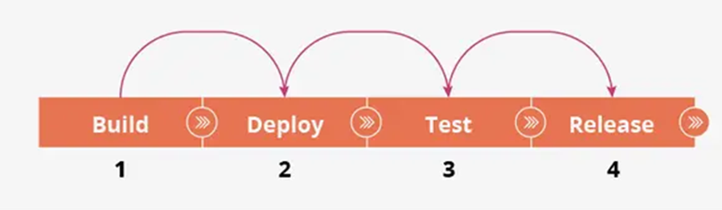
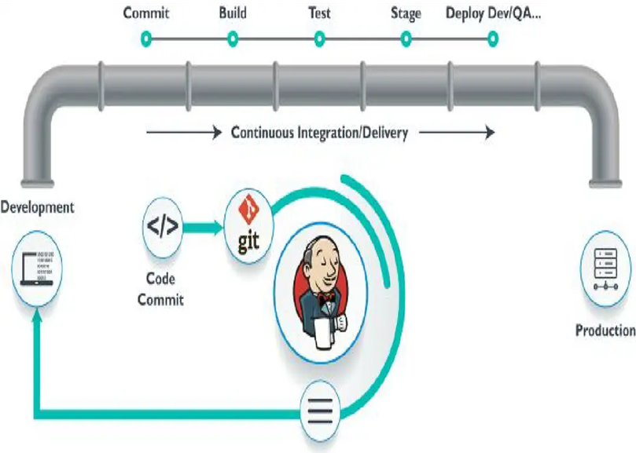
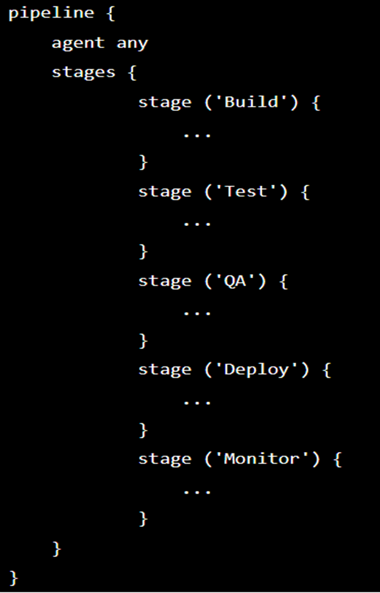
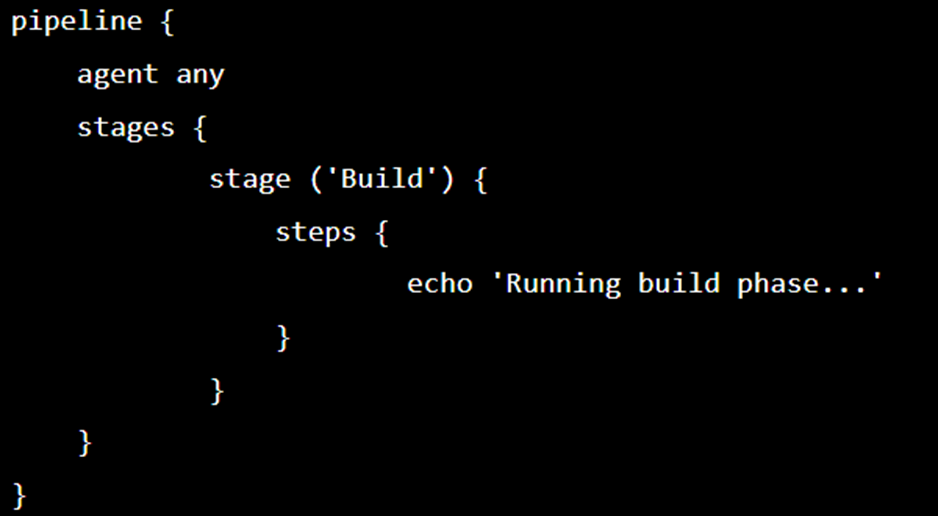
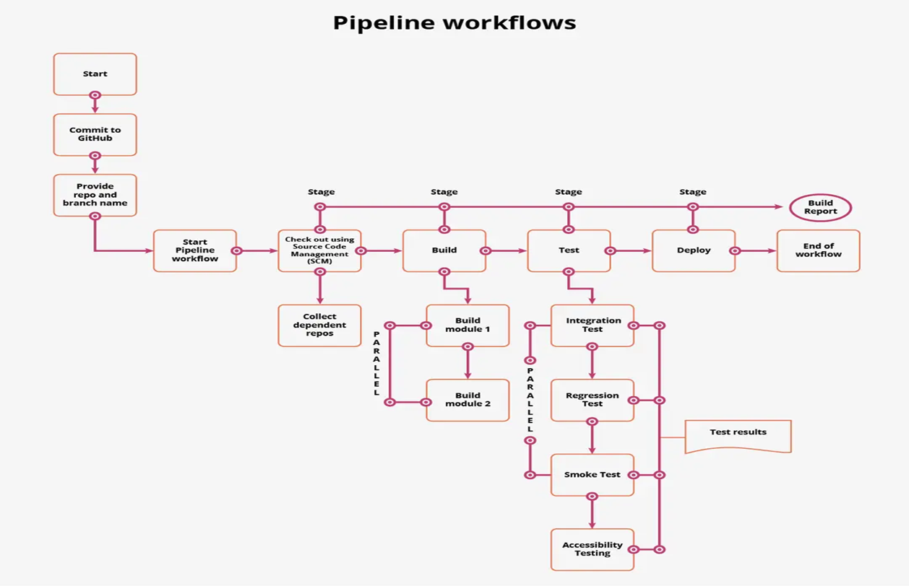
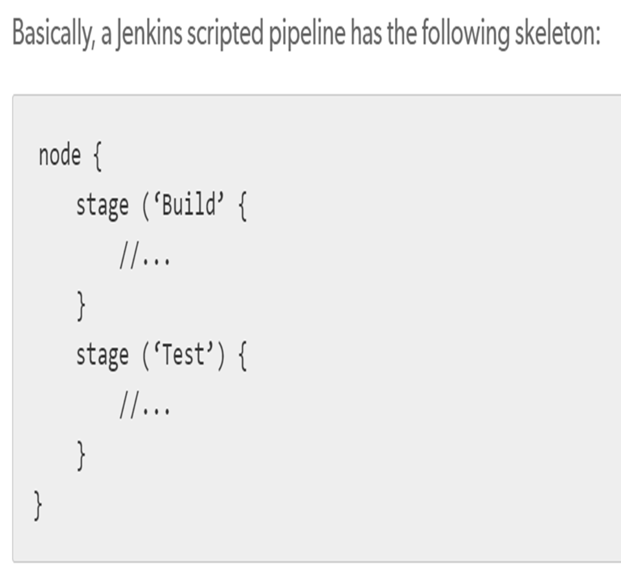

# Jenkins

## Table of Contents

1. [What is Jenkins?](#what-is-jenkins)
2. [Why We Use Jenkins](#why-we-use-jenkins)
3. [Jenkins Workflow](#jenkins-workflow)
4. [Jenkins Jobs](#jenkins-jobs)
    - [Types of Jenkins Jobs](#types-of-jenkins-jobs)
5. [Jenkins Pipeline](#jenkins-pipeline)
    - [How Do Continuous Delivery Pipelines Work?](#how-do-continuous-delivery-pipelines-work)
    - [Why Pipelines](#why-pipelines)
    - [Pipeline Concepts](#pipeline-concepts)
    - [Pipeline Syntax](#pipeline-syntax)
    - [Pipeline Example](#pipeline-example)
6. [Scripted Pipeline vs. Declarative Pipeline](#scripted-pipeline-vs-declarative-pipeline)

---

## What is Jenkins?

- **Jenkins** is an open-source automation server that facilitates software projects’ continuous integration and delivery (CI/CD).
- It provides a framework for automating applications’ building, testing, and deployment, enabling teams to streamline their software development processes.
- With Jenkins, developers can set up a pipeline defining the steps required to build, test, and deploy their applications.
- These steps can include tasks like compiling source code, running unit tests, packaging the application, deploying it to a staging environment for further testing, and finally deploying it to production.

### Additional Details

- **Integration with Version Control Systems**: Jenkins supports integration with various version control systems, such as Git, Subversion, and Mercurial, allowing it to automatically trigger builds and tests whenever changes are pushed to the repository.
- **Tool and Technology Integration**: It integrates with a wide range of tools and technologies, including build tools, testing frameworks, and deployment platforms.
- **Web-Based Interface**: Jenkins provides a web-based interface that allows users to configure and manage their build pipelines and monitor the status of builds.
- **Extensive Plugin Ecosystem**: It offers a vast ecosystem of plugins, which extend its functionality and allow integration with additional tools and services.

---

## Why We Use Jenkins

### Continuous Integration (CI)

- **Automated Building and Testing**: Jenkins facilitates continuous integration by automatically building and testing software whenever changes are made to the codebase.
- **Early Issue Identification**: It helps identify issues and conflicts early in the development process, leading to faster feedback and easier bug resolution.

### Automated Testing

- **Integration of Testing Frameworks**: Jenkins allows the integration of automated testing frameworks into the build process.
- **Execution of Various Tests**: It can execute unit tests, integration tests, and other types of tests to ensure that the software functions as expected and meets the defined quality criteria.

### Continuous Delivery and Deployment (CD)

- **Automation of Packaging and Deployment**: Jenkins enables continuous delivery and deployment by automating the steps involved in packaging, deploying, and releasing software.
- **Streamlined Release Process**: It streamlines the release process, reduces human error, and allows for frequent and reliable software deployments.

### Build and Release Management

- **Centralized Platform**: Jenkins provides a centralized platform for managing build configurations, artifacts, and release versions.
- **Change Tracking and Dependency Management**: It tracks changes, manages dependencies, and ensures consistency across different builds and environments.

### Scalability and Flexibility

- **High Scalability**: Jenkins is highly scalable and can support projects of various sizes and complexities.
- **Concurrent Builds and Distributed Work**: It can handle multiple builds concurrently and distribute work across multiple nodes for faster execution.
- **Extensive Plugin Support**: Jenkins offers extensive plugin support, allowing integration with a wide range of tools and technologies.

### Community and Ecosystem

- **Active Community**: Jenkins has a large and active community of users and contributors.
- **Vibrant Ecosystem**: This vibrant ecosystem offers a vast array of plugins, documentation, and community support, making it easier to extend Jenkins’ functionality and find solutions to common challenges.

### Open Source and Cost-Effective

- **Free and Customizable**: Jenkins is an open-source tool, which means it is freely available for use and can be customized as per project requirements.
- **Cost-Effective Choice**: This makes it a cost-effective choice compared to commercial alternatives.

**Summary**: Jenkins is used to automate build, test, and deployment processes, improve software quality, enable continuous integration and delivery, and provide a flexible and scalable platform for managing software development projects.

---

## Jenkins Workflow

1. **Code Modification and Commit**
    - Developers modify the source code and commit changes to the repository.
    - Jenkins creates a new build to handle the new Git commit.

2. **Triggering Builds**
    - Jenkins can work in **“push”** or **“pull”** mode.
    - The Jenkins CI server is either triggered by an event such as a code commit, or it can regularly check the repository for changes.

3. **Building and Artifact Generation**
    - The build server builds the code and generates an artifact.
    - If the build fails, the developer receives an alert.

4. **Deployment to Test Server**
    - Jenkins deploys the built application/executable to the test server.
    - Continuous, automated tests are executed.
    - Developers receive alerts if their changes impact functionality.

5. **Optional Deployment to Production**
    - Jenkins optionally deploys the changes to the production server if the code has no issues.

---

## Jenkins Jobs

- **Jenkins Jobs** are a given set of tasks that run sequentially as defined by the user.
- Any automation implemented in Jenkins is a **Jenkins Job**.
- These jobs are a significant part of Jenkins's build process.
- We can create and build Jenkins jobs to test our application or project.
- With a Jenkins Job, you can clone source code from version control like Git, compile the code, and run unit tests based on your requirements.

### Types of Jenkins Jobs

| **Job Type**            | **Description**                                                                                                                                                                      |
|-------------------------|--------------------------------------------------------------------------------------------------------------------------------------------------------------------------------------|
| **Freestyle Project**   | This is the central and the most widely used feature in Jenkins. It is an available Jenkins build job offering multiple operations. Using this option, you can build and run pipelines or scripts seamlessly. |
| **Maven Project**       | If your work involves managing and building projects containing POM files, you prefer using Maven Project to build jobs in Jenkins. Jenkins, by default, will pick the POM files, make configurations, and run builds. |
| **Pipeline**            | Freestyle Project is often not a good option to create Jenkins Jobs. Therefore, Pipeline is the best option. Use the Pipeline option for creating Jenkins Jobs, especially when working on long-running activities. |
| **Multi-configuration Project** | If you are working on a project requiring multiple configurations, you prefer to use the Multi-configuration Project option. This option allows for making multiple configurations for testing in multiple environments. |
| **GitHub Organization** | If you click on this option, it scans the User's GitHub account for all repositories and then matches markers as defined.                                                                            |

---

## Jenkins Pipeline

- **Jenkins Pipeline** is a mixture of plugins that helps in the combination and implementation of continuous integration and delivery pipelines.
- It has an extensible automation server to create easy and complex transport pipelines as code through Pipeline DSL.
- A **Pipeline** is a collection of events linked with every difference in a sequence.

### How Do Continuous Delivery Pipelines Work?

- **Dependency on Events**: Each task or event in a Jenkins pipeline depends in some way on at least one or more other jobs or events.
- **Pipeline Stages**: A continuous delivery pipeline in Jenkins typically has four states: build, deploy, test, and release.
- **Continuous Supply Pipeline**: These states and their events follow a continuous supply pipeline.


### Why Pipelines

- **Code-Based Development**: Jenkins pipeline is developed using code, allowing numerous people to change and run the pipeline process.
- **Resilience**: The pipeline will thus be immediately resumed if your server has to restart for some reason.
- **Controlled Execution**: The pipeline process can be stopped, and you can instruct it to not restart until the user provides input.
- **Support for Large Projects**: Jenkins Pipelines assist with large projects. It's possible to use pipelines in a loop and perform numerous jobs.



### Pipeline Concepts

#### Pipeline

- The pipeline is a set of instructions for continuous delivery that are provided as code and contain all the instructions required for the complete build process.
- The application may be built, tested, and delivered using the pipeline.
    ```jenkins
        pipeline{
            
        }
    ```
#### Node

- Jenkins runs on a machine known as a node.
- The programmed pipeline syntax makes extensive use of node blocks.
    ```jenkins
        node{
            
        }
    ```

#### Stage

- An assembly of pipeline steps is called a stage block.
- In other words, a stage is where the procedures for build, test, and deployment are all together.
- In most cases, the Jenkins pipeline process is represented by a stage block.

    

#### Step

- Simply put, a step is a single job that completes a particular procedure at a specific time.
- There are several steps in a pipeline.

    

### Pipeline Syntax

- **Jenkinsfile Styles**: Your Jenkinsfile can be defined using one of two styles of syntax.
  
  1. **Declarative**
     - A straightforward method for building pipelines with a preconfigured hierarchy.
     - Allows you to easily and plainly handle every facet of a pipeline action.
  
  2. **Scripted**
     - A lightweight executor helps the Jenkins master run scripted Jenkins pipeline syntax.
     - The pipeline is transformed into atomic commands with a minimal number of resources.

- **Distinct Syntaxes**: Declarative and Scripted syntax are completely distinct from one another and are defined differently.

### Pipeline Example



#### The Jenkinsfile

- **Pipeline as Code**: Based on the idea of being able to add the pipeline script to a code repository for source control and versioning.
- **Jenkinsfile**: The text file containing the code of your pipeline is also known as a Jenkinsfile.
- **Advantages**:
  - Can be reviewed/edited by other team members.
  - The file can be versioned and included with your application builds.
  - Can be edited through the Jenkins web interface or with a text editor or preferred IDE.
  - Configure Jenkins to automatically poll your repo, triggering new builds when updates are detected.

---

## Scripted Pipeline vs. Declarative Pipeline

### Scripted Pipeline

- **Elements**:
  - Uses elements like `node`.
- **Syntax Characteristics**:
  - More flexible and allows for complex scripting.
  - Defined using Groovy-based syntax.

### Declarative Pipeline

- **Elements**:
  - Uses elements like `pipeline`, `agent`, and `steps`.
- **Syntax Characteristics**:
  - Designed to make it easier to develop and maintain your code by providing a more meaningful syntax.
  - Preconfigured hierarchy for building pipelines.
  - More structured and opinionated compared to Scripted Pipeline.

### Comparison

| **Aspect**                  | **Scripted Pipeline**                                                                                                                                     | **Declarative Pipeline**                                                                                                        |
|-----------------------------|----------------------------------------------------------------------------------------------------------------------------------------------------------|---------------------------------------------------------------------------------------------------------------------------------|
| **Syntax Elements**         | `node`, `stage`, `steps`                                                                                                                                  | `pipeline`, `agent`, `stages`, `steps`                                                                                          |
| **Flexibility**             | Highly flexible, allowing complex scripting and logic                                                                                                      | More structured, easier to read and maintain                                                                                     |
| **Use Case**                | Suitable for complex pipelines that require advanced scripting                                                                                            | Ideal for most common CI/CD pipelines with straightforward build, test, and deploy stages                                          |
| **Ease of Use**             | Requires knowledge of Groovy and scripting                                                                                                                 | More user-friendly with a clear and concise syntax                                                                              |
| **Maintenance**             | Can become hard to maintain with increased complexity                                                                                                     | Easier to maintain due to its structured nature                                                                                  |
| **Best Practices**          | Best suited for scenarios where maximum flexibility is required                                                                                           | Recommended for most users due to its simplicity and maintainability                                                             |
| **Example Syntax**          | ```groovy<br>node {<br>  stage('Build') {<br>    // build steps<br>  }<br>}```                                                                             | ```groovy<br>pipeline {<br>  agent any<br>  stages {<br>    stage('Build') {<br>      steps {<br>        // build steps<br>      }<br>    }<br>  }<br>}``` |

---

## Pipeline Example

### Creating a Jenkinsfile

**Pipeline as Code** is based on the idea of being able to add the pipeline script to a code repository for source control and versioning.

- **Jenkinsfile**: The text file containing the code of your pipeline is also known as a Jenkinsfile.
- **Advantages**:
  - Can be reviewed and edited by other team members.
  - The file can be versioned and included with your application builds.
  - Can be edited through the Jenkins web interface or with a text editor or preferred IDE.
  - Configure Jenkins to automatically poll your repository, triggering new builds when updates are detected.

**Example Jenkinsfile (Declarative Pipeline):**

```groovy
pipeline {
    agent any
    stages {
        stage('Build') {
            steps {
                echo 'Building...'
                // Add build steps here
            }
        }
        stage('Test') {
            steps {
                echo 'Testing...'
                // Add test steps here
            }
        }
        stage('Deploy') {
            steps {
                echo 'Deploying...'
                // Add deploy steps here
            }
        }
    }
}
```



---

## Additional Resources

- [Jenkins Official Documentation](https://www.jenkins.io/doc/)
- [Jenkins Pipeline Documentation](https://www.jenkins.io/doc/book/pipeline/)
- [Getting Started with Jenkins](https://www.jenkins.io/doc/book/getting-started/)
- [Jenkins Plugins](https://plugins.jenkins.io/)
